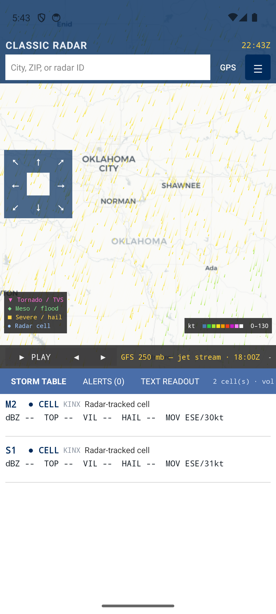
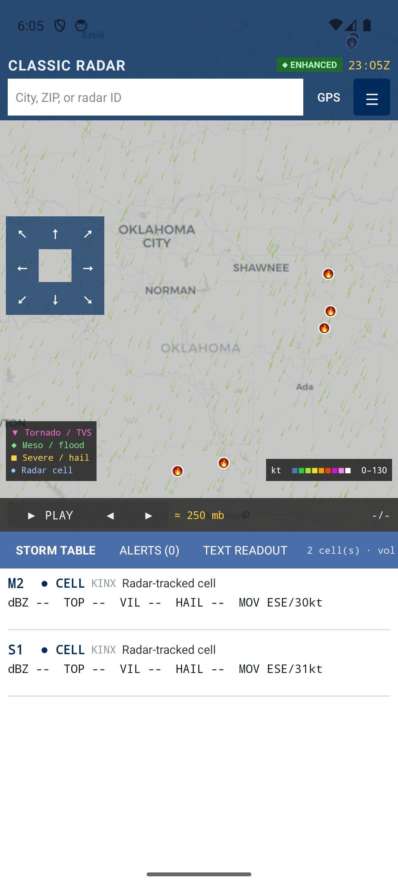

# Classic Radar

**The old Weather Underground NEXRAD page, reborn — and then some.**

A free, fast, data-dense weather workstation in a single static page: real NEXRAD
products, storm-cell science decoded in your browser, animated everything, and zero
API keys. If you miss the clinical pre-acquisition wunderground.com radar selector —
the one with the product dropdown, the storm attribute table, and no ads — this is it,
rebuilt on today's open data feeds and pushed a good deal further.

**Live:** https://extrosy-sys.github.io/ClassicRadar/ · **Manual:** [MANUAL.md](MANUAL.md)



## What it does

**Radar**
- Base + composite reflectivity stills (crisp IEM z12 / NCEP MRMS), animated national loops
- **Canada included**: Environment Canada rain/snow composites with ~3-hour animated history
- **Single-radar tilt viewer**: super-res reflectivity, velocity, correlation coefficient and
  differential reflectivity, with a tilt slider — decoded from raw NEXRAD Level III *in the browser*
- **3D volumetric storm view**: point-cloud / soft-blob / marching-cubes isosurface renders of the
  actual radar volume, multi-radar combined to fill each radar's cone of silence, animatable

**Storm science (all client-side Level III decoding)**
- Storm cells with motion vectors and forecast tracks (NST), per-cell echo tops (EET) and
  VIL (DVL), merged with NWS warning threat tags into the classic storm attribute table
- Alerts tab with every active NWS product in view, full text, map-linked with overlap picker
- New-warning chime, and real phone push notifications via the optional server (ntfy)

**Layers on everything**
- GOES-East satellite (IR / GeoColor / Air Mass RGB) — animated
- Winds aloft as **flowing color-coded particles** at surface, 850, 700, 500 and 250 mb
- Wildfire incidents + mapped perimeters (NIFC) and Canadian satellite hotspots (CWFIS)
- Smoke plumes (NOAA HMS analyst polygons, light/medium/heavy)
- **Air quality** — EPA AirNow AQI contours in the standard six colors
- Tropical: NHC cones, forecast tracks, watch/warning coastlines
- SPC outlooks, watches, and mesoscale discussions
- Precipitation accumulations, surface observations with plain-English METAR decode
- Click anywhere → 12-hour point forecast with CAPE and current AQI (works in Canada too)

**Playback**
- Loop any animatable product; flicker-free whole-US composite frames at national zoom
- **Time machine**: scrub the loop's end anywhere in the last 24 hours and replay the day —
  the pin follows you across products (radar at 09Z ↔ satellite at 09Z ↔ rainfall at 09Z)

## Zero keys, graceful tiers

Every feature above the ◆ line works from the static page alone — every data source is a
free, keyless public feed (NWS, IEM, NASA GIBS, NOAA NODD, ECCC GeoMet, Open-Meteo, NIFC,
EPA…). The optional **enhancement server** (a single self-contained Windows exe on any spare
machine) adds the ◆ tier: 24-hour archives of everything, MRMS severe grids (hail, VIL,
rotation, real NLDN lightning), finer wind grids, smoke, tropical, slim alert payloads, and
phone push. If the server is off, the site silently falls back — nothing breaks.

## Android

A native companion app (Kotlin + osmdroid, no Play Services) carries the same feature set —
including its own from-scratch NEXRAD Level III binary decoder — and speaks to the same
optional server. Sideload APK; see the private companion repo.



## Run it

It's a static page — serve the folder any way you like:

```bash
python -m http.server 8777
```

then open http://localhost:8777. Or just use the GitHub Pages copy above.

*Not an official product of NOAA, NWS, ECCC, or anyone else. Data comes from public
government feeds; verify warnings through official channels.*
